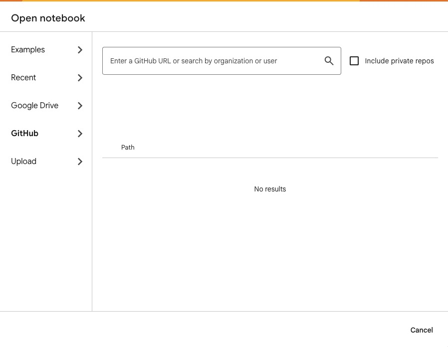

# How to Open in Google Colab

<strong>📖 Click here for instructions on opening this notebook in Google Colab</strong>

### Option 1: Open Directly from GitHub (Recommended)

1. Click the notebook link above
2. Click the **"Open in Colab"** badge at the top of the notebook, OR
3. Copy the GitHub URL and go to [https://colab.research.google.com](https://colab.research.google.com)
4. Select **File → Open notebook → GitHub tab**
5. Paste the repository URL: `https://github.com/harl00/AIinHealthcare`
6. Select the notebook you want to open

### Option 2: Download and Upload

1. Click the notebook link above
2. Click **"Download"** or right-click → Save as
3. Go to [https://colab.research.google.com](https://colab.research.google.com)
4. Select **File → Open notebook**
5. In the dialog that appears, click **Upload** in the left sidebar:

    

6. Choose the downloaded `.ipynb` file from your computer

### Important: Save Your Own Copy

Once opened in Colab:
- Go to **File → Save a copy in Drive**
- This creates your own editable version
- Your work will auto-save to your Google Drive

### First Time Using Colab?

If you haven't completed the [Pre-course Orientation](../curriculum/00-pre-course-orientation.md), we recommend doing that first to familiarize yourself with the Colab environment.

